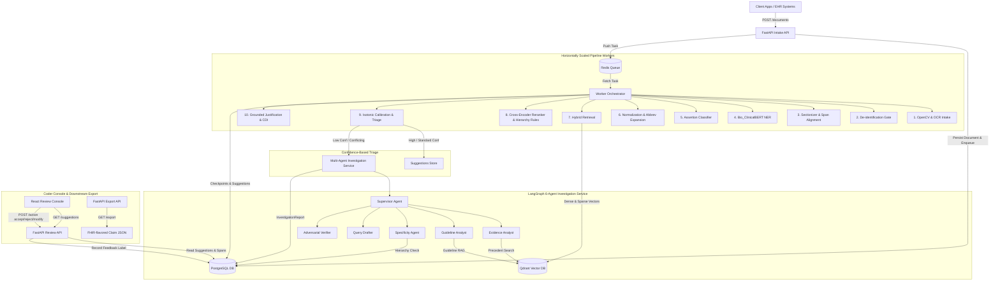
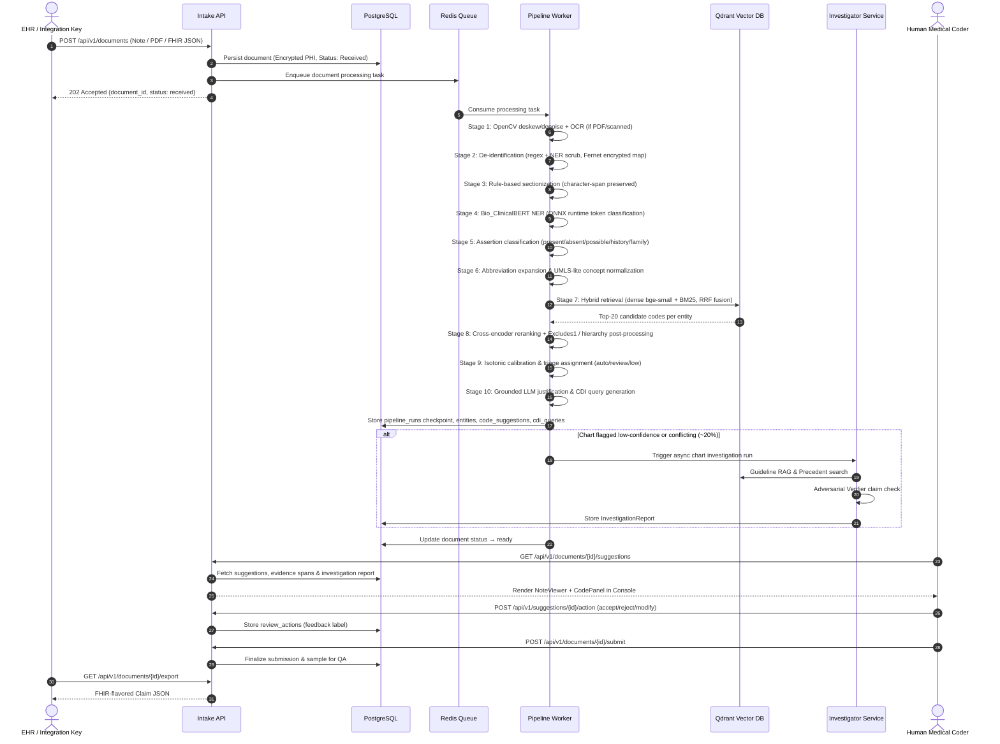
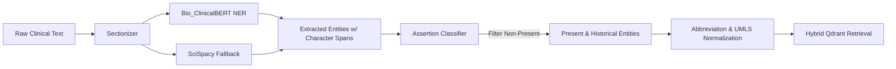
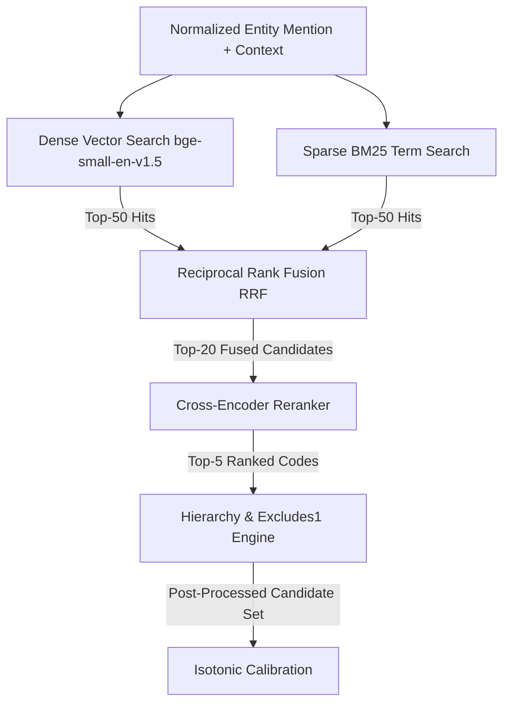
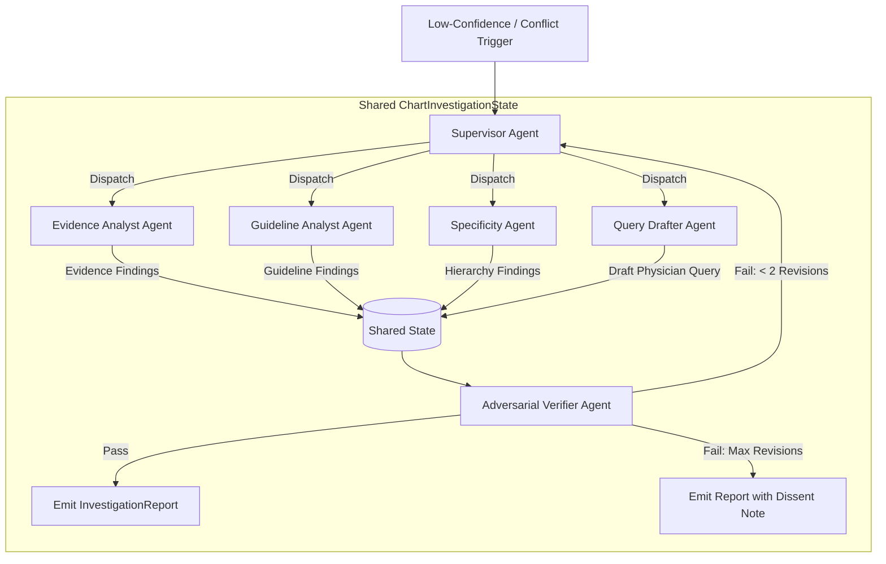
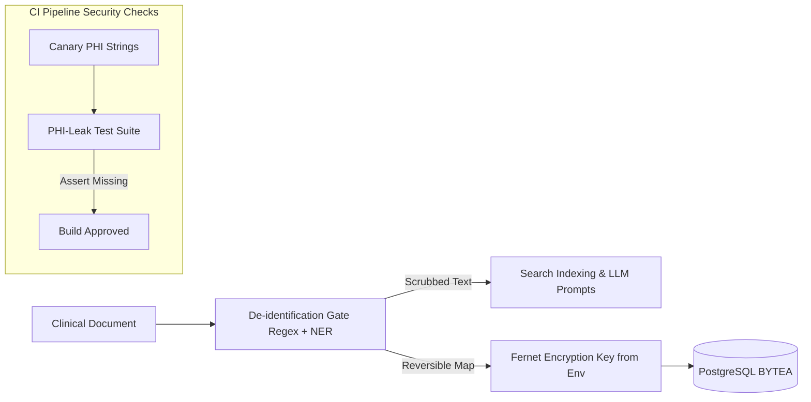

# ClinCode Architecture Specification

This document provides a detailed specification of the architecture, data flows, components, security controls, and design principles of **ClinCode** — an evidence-linked clinical documentation intelligence and medical coding automation platform with human-in-the-loop (HITL) review.

---

## 1. System Architecture Overview

ClinCode is designed as a decoupled, microservices-based system. It separates raw clinical document intake, heavy NLP/retrieval worker processing, autonomous agentic chart investigation, user-facing administrative/review APIs, and interactive coder review consoles.



---

## 2. End-to-End Data Flow

Document processing follows a 15-step immutable lifecycle, tracking provenance and stage checkpoints at every step:



---

## 3. Service Architecture

### 3.1 Services Breakdown

1. **Intake & Review API (`services/api`)**:
   * Built with FastAPI and Pydantic v2.
   * Exposes stateless REST endpoints for intake, document status, coder review operations, CDI query interactions, FHIR exports, and admin metrics.
   * Enforces JWT authentication and Role-Based Access Control (RBAC).

2. **Pipeline Workers (`services/pipeline`)**:
   * Asynchronous, queue-driven Python workers scaled horizontally off a Redis queue.
   * Executes the 10-stage NLP, normalization, retrieval, reranking, calibration, and grounding pipeline.
   * Persists stage-by-stage checkpoints to PostgreSQL (`pipeline_runs` table) to guarantee idempotent execution and fault recovery.

3. **Investigator Service (`services/investigator`)**:
   * Multi-agent execution engine built using LangGraph.
   * Manages stateful, asynchronous chart investigation runs triggered by low-confidence scores, assertion conflicts, or Excludes1 collisions.
   * Operates exclusively through read-only tools, guideline RAG, precedent memory, and an adversarial verifier gate.
   * Exposes coding knowledge tools via a Model Context Protocol (MCP) server interface on de-identified data.

4. **Frontend Coder Console (`services/frontend`)**:
   * Single-page application built with React 18, TypeScript, and Vite.
   * Features interactive dual-pane view: `NoteViewer` with layered entity highlights and `CodePanel` with confidence band badges, evidence chips, and CDI cards.

### 3.2 Infrastructure & Persistence Layer

* **PostgreSQL 15**: Primary relational database handling transactional storage for documents, pipeline checkpoints, extracted entities, code suggestions, review actions, CDI queries, user accounts, and audit trails.
* **Redis**: In-memory message broker managing asynchronous job queues for pipeline workers and investigation runs.
* **Qdrant**: High-performance vector database hosting three specialized vector collections:
  * `icd10`: ICD-10-CM code descriptions, synonyms, and inclusion/exclusion notes (dense + sparse vectors).
  * `coding_guidelines`: Clause-level official CMS coding guidelines with section metadata.
  * `chart_precedents`: De-identified embeddings of coder-approved chart codings and rejected suggestions.
* **MLflow**: Centralized registry tracking model experiments, parameters, metrics, artifacts, and ONNX model binary versions.
* **DVC (Data Version Control)**: Versioning framework managing raw clinical note corpora (`mtsamples/`), parsed ICD-10 code tables (`icd10cm/`), and gold evaluation charts (`gold_charts/`).

---

## 4. Machine Learning & Clinical NLP Architecture



### 4.1 Named Entity Recognition (NER)
* **Model**: Fine-tuned `Bio_ClinicalBERT` (`emilyalsentzer/Bio_ClinicalBERT`) token classifier trained with BIO-tagging schema (`B-COND`, `I-COND`, `B-PROC`, `I-PROC`, `B-MED`, `I-MED`, `B-ANAT`, `I-ANAT`).
* **Fallback & Alignment**: `SciSpacy` biomedical pipeline serves as fallback for unclassified spans. Exact character-start and character-end offsets are mapped to original text spans.
* **Export**: Model exported to ONNX format for accelerated CPU inference in worker containers.

### 4.2 Assertion Classifier
* **Architecture**: Fine-tuned sequence classification head over `Bio_ClinicalBERT` consuming entity text surrounded by a $\pm 2$-sentence context window.
* **Target Classes**:
  1. `present`: Active condition diagnosed or confirmed.
  2. `absent`: Negated mention (e.g., "no evidence of pneumonia").
  3. `possible`: Equivocal or suspected mention (e.g., "rule out sepsis").
  4. `conditional`: Dependent mention (e.g., "if symptoms persist").
  5. `historical`: Past condition no longer active.
  6. `family`: Family medical history (e.g., "mother had breast cancer").
* **Filtering Gate**: Only entities labeled `present` (and configurably `historical`) proceed to ICD-10 code retrieval. Negated, possible, and family history mentions are filtered out.

### 4.3 Entity Normalization
* **Abbreviation Expansion**: Custom biomedical clinical dictionary expands acronyms (e.g., "HTN" $\rightarrow$ "hypertension", "DM2" $\rightarrow$ "type 2 diabetes mellitus").
* **Concept Mapping**: UMLS-lite concept lookup table maps clinical synonyms to standardized concept identifiers before candidate code retrieval.

---

## 5. ICD-10 Code Retrieval & Ranking Architecture



### 5.1 Knowledge Indexing (Qdrant)
* Code records constructed from official CMS ICD-10-CM code tables, containing code string, full description, synonyms, chapter/block/category hierarchy metadata, billable flags, and Excludes1 lists.
* **Embeddings**: Dual dense vectors generated using `bge-small-en-v1.5` (benchmarked against biomedical encoders like `S-PubMedBert`) and sparse vectors for BM25 keyword matching.

### 5.2 Retrieval & Fusion
* Candidate retrieval executes per normalized entity mention.
* Parallel dense vector search and sparse BM25 search pull top-50 candidates each from Qdrant.
* **Reciprocal Rank Fusion (RRF)** fuses dense and sparse candidate lists:
  $$RRF\_Score(d) = \sum_{m \in \{dense, sparse\}} \frac{1}{k + r_m(d)}$$
  where $k = 60$ and $r_m(d)$ is the rank of candidate code $d$ in list $m$.

### 5.3 Cross-Encoder Reranking
* Top-20 candidates from RRF pass through a cross-encoder model trained on `(mention_context, icd10_description)` pairs.
* Hard negatives are mined from confusable sibling codes (codes sharing the same category but differing in specificity) during training.
* Outputs refined relevance scores for top-5 candidates.

### 5.4 Hierarchy Post-Processing & Excludes1 Rules
* **Depth Specificity**: System prefers maximally specific billable codes (7-character codes over 3-character category codes).
* **Excludes1 Conflicts**: Deterministic rule validator checks Excludes1 constraints; mutually exclusive codes are filtered or flagged.
* **Modifier Fusion**: Text search merges laterality (left/right/bilateral) and encounter-type (initial/subsequent/sequela) modifiers into candidate code selection.

---

## 6. Human-in-the-Loop & Selective Prediction Architecture

```
                                [Code Candidates]
                                        │
                                        ▼
                           [Isotonic Calibration]
                                        │
             ┌──────────────────────────┼──────────────────────────┐
             ▼                          ▼                          ▼
   Calibrated Conf ≥ 0.85     0.50 ≤ Calibrated Conf < 0.85   Calibrated Conf < 0.50
   [AUTO-ACCEPT BAND]              [REVIEW BAND]             [LOW-CONF / CONFLICT]
   • Target Precision: ≥98%   • Interactive Review       • Auto-Routed to Agent
   • Coverage Target: ≥30%    • Evidence-Jump Highlight    Investigation Team
   • Coder 1-Click Submit     • Accept / Modify / Reject • Typed InvestigationReport
```

### 6.1 Calibration & Selective Prediction
* Raw cross-encoder scores are calibrated using Isotonic Regression fit on a held-out validation set of coded charts.
* Calibrated confidence scores map to three operational triage bands:
  1. **Auto-Accept Band** ($\ge 0.85$ calibrated confidence): High-confidence predictions targeting $\ge 98\%$ precision. Coder performs one-click confirmation on submission.
  2. **Review Band** ($0.50 - 0.84$ calibrated confidence): Standard suggestions requiring human coder evidence verification.
  3. **Low-Confidence / Conflicting Band** ($< 0.50$ calibrated confidence or Excludes1 collision): Automatically routed to the multi-agent investigation team.

### 6.2 Coder Feedback Loop
* Every action in the review console (`accept`, `reject`, `modify`) is recorded in the `review_actions` PostgreSQL table with reason codes and final coder-selected codes.
* Weekly job processes feedback data:
  * Rejects and modifications serve as hard negatives for cross-encoder retraining.
  * Approved codings update the isotonic calibration mapping.
  * De-identified approved chart codings are embedded into the Qdrant `chart_precedents` collection.

---

## 7. Autonomous Agentic Investigation Architecture

For the ~20% of complex charts flagged low-confidence or conflicting, ClinCode invokes an autonomous multi-agent chart investigation team orchestrated using **LangGraph**.



### 7.1 Agent Roles & Responsibilities

1. **Supervisor Agent**: Plans the investigation strategy based on the trigger reason (low confidence, assertion conflict, Excludes1 collision). Dispatches specialist agents, enforces execution budgets ($\le 12$ total tool calls, $\le 2$ revision loops), and maintains state.
2. **Evidence Analyst Agent**: Uses `note_tools` (`search_note_sections`, `get_entities`) to re-examine text context surrounding uncertain entities, identifying subtle clinical cues (e.g., active medications implying unstated conditions).
3. **Guideline Analyst Agent**: Performs advanced RAG via `guideline_tools` (`guideline_search`) over official CMS ICD-10-CM guidelines in Qdrant. Retrieves sequencing rules, combination-code clauses, and chapter conventions.
4. **Specificity Agent Agent**: Uses `hierarchy_tools` (`icd10_hierarchy`) and `rules_tools` (`coding_rules_check`) to inspect parent/child/sibling code nodes, check laterality/acuity, and resolve Excludes1 collisions.
5. **Query Drafter Agent**: When an investigation reveals a documentation gap (e.g., unspecified heart failure acuity), drafts a compliant, non-leading CDI physician query.
6. **Adversarial Verifier Agent**: Acts as a strict quality gate attacking draft recommendations. Every proposed code must satisfy three mandatory checks:
   - Must carry an exact evidence span from the note.
   - Must carry a supporting guideline citation or hierarchy justification.
   - Must have zero Excludes1 conflicts.
   - Recommendations failing any check are rejected back to the Supervisor for revision.

### 7.2 Read-Only Tool & Precedent Constraints
* Agents interact strictly through whitelisted, read-only python functions.
* Agents can **never** modify the auto-accept band, **never** generate codes outside the retrieved candidate set, and **never** touch production database records directly.
* **Precedent Memory**: Agents query the Qdrant `chart_precedents` collection to cite past coder-approved chart patterns and avoid re-proposing previously rejected code patterns.

---

## 8. Security & Privacy Architecture



1. **PHI Scrubbing & De-identification**: Raw clinical documents pass through regex rules and NER scrubbing prior to search indexing or LLM prompting. Names, MRNs, dates, phone numbers, and addresses are replaced with typed placeholders (e.g., `[NAME_1]`).
2. **Fernet Encryption**: Reversible PHI lookup maps and raw text BYTEA columns are Fernet-encrypted using keys managed via environment variables.
3. **RBAC & Authentication**: JWT tokens with role scopes:
   * `coder`: Access assigned worklists, perform review actions, submit charts.
   * `cdi_specialist`: Review, edit, and send CDI physician queries.
   * `manager`: View throughput, acceptance rate, chapter drift dashboards.
   * `admin`: View system metrics, ONNX model versions, trigger retrain runs.
4. **Audit Trail**: Every chart access, code modification, query creation, and FHIR export writes an immutable record to `audit_log`.
5. **CI PHI-Leak Canaries**: CI test suites inject synthetic PHI canaries and assert their complete absence from vector databases, application logs, and test fixtures.

---

## 9. Database & Persistence Architecture

### 9.1 PostgreSQL Relational Schema

* `documents`: `id` (UUID PK), `external_ref`, `doc_type`, `raw_text_encrypted` (BYTEA), `deid_text` (TEXT), `phi_map_encrypted` (BYTEA), `status` (`received`, `processing`, `ready`, `failed`, `quarantined`), `version`, `created_at`.
* `pipeline_runs`: `id` (UUID PK), `document_id` (FK), `stage`, `status`, `model_versions` (JSONB), `started_at`, `finished_at`, `error`.
* `entities`: `id` (UUID PK), `document_id` (FK), `text`, `label`, `start_char`, `end_char`, `section`, `assertion`, `concept_id`, `ner_conf`.
* `code_suggestions`: `id` (UUID PK), `document_id` (FK), `entity_id` (FK), `icd10_code`, `description`, `rank`, `raw_score`, `calibrated_conf`, `band` (`auto`, `review`, `low`), `justification_md`, `grounded` (BOOL), `evidence_spans` (JSONB), `provenance` (JSONB).
* `review_actions`: `id` (UUID PK), `suggestion_id` (FK), `coder_id` (FK), `action` (`accept`, `reject`, `modify`), `final_code`, `reason`, `at` (TIMESTAMPTZ).
* `chart_submissions`: `id` (UUID PK), `document_id` (FK), `coder_id` (FK), `final_codes` (JSONB), `qa_pair_id`, `submitted_at`.
* `cdi_queries`: `id` (UUID PK), `document_id` (FK), `gap_type`, `query_md`, `status` (`draft`, `sent`, `answered`, `dismissed`), `created_at`.
* `icd10_codes`: `code` (PK), `description`, `chapter`, `block`, `category`, `billable` (BOOL), `excludes1` (JSONB), `synonyms` (JSONB).
* `investigation_runs`: `id` (UUID PK), `document_id` (FK), `trigger`, `status`, `report` (JSONB), `agent_versions` (JSONB), `verifier_pass` (BOOL), `started_at`, `finished_at`.

### 9.2 Qdrant Vector Collections

| Collection Name | Vector Specs | Payload Data | Purpose |
| :--- | :--- | :--- | :--- |
| `icd10` | Dense (384-d `bge-small-en-v1.5`) + Sparse BM25 | `{code, chapter, block, category, billable, excludes1[]}` | Code candidate retrieval per entity mention. |
| `coding_guidelines` | Dense (384-d) + Sparse BM25 | `{section, chapter_scope, rule_type, text}` | Clause-level official coding guideline RAG. |
| `chart_precedents` | Dense (384-d) | `{document_id, codes[], outcome, evidence_summary}` | Precedent memory of approved and rejected chart patterns. |

---

## 10. Deployment Architecture

ClinCode uses a multi-container Docker Compose setup for local development and staging deployments. Production environments map services to managed cloud equivalents (e.g., AWS RDS PostgreSQL, AWS SQS / ElastiCache Redis, ECS container tasks) behind Caddy reverse proxy with TLS termination.

```yaml
# Conceptual Container Architecture
services:
  postgres:      # Database store (Port 5432)
  redis:         # Task queue & cache (Port 6379)
  qdrant:        # Vector DB (Port 6333)
  mlflow:        # Experiment tracking (Port 5000)
  api:           # FastAPI backend service (Port 8000)
  pipeline:      # Worker replicas consuming Redis tasks
  investigator:  # Multi-agent investigation service (Port 8001)
  frontend:      # Nginx serving React SPA (Port 80)
```

---

## 11. Core Engineering Principles

1. **Retrieval, Not Generation**: LLMs are never permitted to generate ICD-10 code strings freely. All suggested codes originate from the official retrieval index.
2. **Assertion-Aware Extraction**: Code candidate generation is strictly gated by assertion detection to eliminate false positives from negated or family history mentions.
3. **Claim-Level Evidence Pinning**: Every suggestion must link directly to character offsets in the clinical text, giving human coders instant verification capability.
4. **Calibrated Selective Prediction**: Confidence scores are calibrated to separate high-precision auto-confirmations from complex cases requiring deep review.
5. **Risk-Tiered Agent Routing**: Heavy multi-agent investigation is reserved for the ~20% of low-confidence or conflicting charts, preventing unnecessary compute overhead.
6. **Evaluation-Gated MLOps**: System deployments and model upgrades are strictly gated by automated regression tests in CI.
